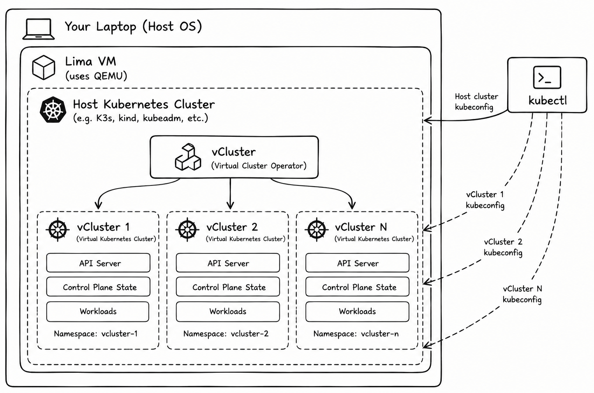

# Architecture

This lab environment is designed to provide lightweight, disposable and isolated Kubernetes environments for hands-on security experimentation.

## Overview

The architecture consists of three main layers:

**Lima / QEMU** provides the virtual machine used to isolate the lab environment from the local host. The VM is disposable and contains the entire Kubernetes lab infrastructure.

**Host Kubernetes Cluster** runs inside the Lima VM and provides the underlying compute, networking and storage resources used by the lab environments.

**vCluster** runs on top of the host Kubernetes cluster and allows virtual Kubernetes clusters to be created on demand. Each vCluster exposes its own Kubernetes API and maintains its own control-plane state, while workloads ultimately consume resources from the underlying host cluster.

## Why This Architecture?

The goal is to avoid provisioning a completely separate Kubernetes environment for every security scenario.

Instead, a single disposable Lima VM can host the base Kubernetes cluster, while vCluster provides lightweight virtual clusters for individual labs and experiments.

This makes it possible to:

- Create and destroy lab environments quickly.
- Keep the lab infrastructure separated from the local host.
- Run multiple Kubernetes security scenarios from the same host cluster.
- Experiment with Kubernetes-in-Kubernetes security boundaries and attack paths.
- Reset environments without rebuilding the entire lab infrastructure.

## Isolation Model

It is important to note that a vCluster is **not equivalent to running a completely independent Kubernetes cluster or VM**.

The virtual clusters provide logical Kubernetes isolation and separate control-plane state, but ultimately rely on infrastructure provided by the host cluster.

That distinction is intentional.

Part of the purpose of these labs is to explore where those isolation boundaries exist, how they can be secured, and what happens when they are broken.

